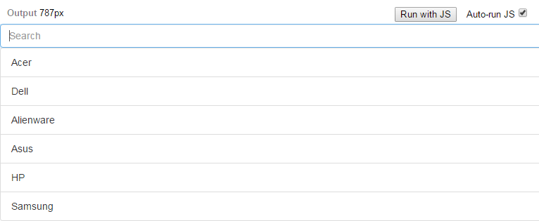

==================================================================
ReactJS: un'interfaccia JavaScript dedicata alle interfacce utente
==================================================================

**ReactJs** è una libreria javascript per costruire *UI* composte da **componenti riutilizzabili**. React si dedica principalmente alla View, ovvero la parte di un qualsiasi progetto che si occupa di visualizzare i contenuti della logica di software (model) e di regolare l'interazione tra utenti e servizi. 

Grazie all'utilizzo di *JSX*, un dialetto del JavaScript, è possibile definire la struttura di ogni componente, che sarà composto di:
* **DOM**: struttura logica di rappresentazione sulla pagina web
* **Comportamento**: come l'applicazione reagisce alle azioni che compie l'utente

=====================
Creatori e casi d'uso
=====================

Attualmente la libreria React è mantenuta da Facebook per facilitare la creazione di componenti interattivi, orientati agli stati e riutilizzabili. Instagram è scritto interamente in ReactJS, ma vi sono altri siti degni di nota che lo implementano all'interno delle proprie applicazioni web, come ad esempio:

* **Netflix** (http://www.netflix.com)
* **Imgur** (http://imgur.com/)
* **Airbnb** (https://www.airbnb.it/)
* **Wordpress** (https://developer.wordpress.com/calypso/)

====================
Componenti specifici
====================

Il punto cruciale della visualizzazione di un componente è il metodo *render()*: vediamone un esempio.

```javascript
	var HelloMessage = React.createClass({
	  render: function() {
		return <div>Hello {this.props.name}</div>;
	  }
	});
```

Ogni componente React tiene rigorosamente conto di ogni suo **stato**. Gli stati del componente corrispondono alle variabili che ogni suo oggetto assume al momento della creazione, e vengono dichiarati nel metodo *getInitialState()*.
Inoltre, è ovviamente supportato il salvataggio dell'input dell'utente, nelle cosiddette *props*, ovvero **Proprietà**, come vedremo in seguito.

```javascript
	var Timer = React.createClass({
	  getInitialState: function() {
	    // ritorna un oggetto
		return {secondsElapsed: 0};
	  },
	  // metodo custom per simulare il comportamento di un orologio, secondo dopo secondo
	  tick: function() {
		this.setState({secondsElapsed: this.state.secondsElapsed + 1});
	  },
	  componentDidMount: function() {
		this.interval = setInterval(this.tick, 1000);
	  },
	  componentWillUnmount: function() {
		clearInterval(this.interval);
	  },
	  render: function() {
		return (
		  <div>Seconds Elapsed: {this.state.secondsElapsed}</div>
		);
	  }
	});

ReactDOM.render(<Timer />, mountNode);
```

Andiamo subito ad analizzare il codice sopra riportato. Com'è possibile osservare, il componente Timer è composto da una particolare classe che contiene i metodi *getInitialState()*, *tick()*, *componentDidMount()*, *componentWillUnmount()* e *render()*.

===========================================
Metodi dedicati al ciclo di vita di ReactJS
===========================================

Ecco i principali metodi predefiniti di ReactJS dedicati al lifecycle dei componenti:

* **getInitialState()**: Metodo invocato una volta sola, appena prima che il componente venga creato. Il valore ritornato sarà utilizzato come valore iniziale per *this.state*, il contenitore degli stati del componente.
* **componentDidMount()**: Metodo invocato una volta sola subito dopo il rendering iniziale del componente. Vale solo per il lato client (e non per il server). Da questo componente del ciclo di vita della View, è possibile accedere ad ogni riferimento (refs) dei componenti figli.
* **componentWillMount**: Invocato una volta sola sia a lato client che a lato server appena prima che venga effettuato il rendering. Viene preceduto da *getInitialState()*.
* **componentWillUnmount**: Invocato non appena si interrompe il rendering del componente. Esso compie ogni *pulizia* necessaria nella View, come ad esempio invalidare il timer precedente creato o eliminare ogni commento o like sotto ad un post, o comunque ogni cosa creata all'interno di componentDidMount().

Esistono in oltre metodi setter dedicati, come:

* **setState()**: metodo che lancia l'update dell'interfaccia utente. Letteralmente, imposta il nuovo valore per lo stato del componente.

============================
Differenza tra state e props
============================

Facebook impone alcune norme di "buon utilizzo" degli stati e delle proprietà dei vari componenti.

**Cos'è lo *state*?**

State dovrebbe contenere dati dinamici, il cui cambiamento deve comportare un aggiornamento della UI. Solitamente, questa tipologia di dati è serializzata con lo standard JSON, ed è estremamente ridotta, il che tra l'altro facilita l'utilizzo di ReactJS stesso. Questi dati essenziali saranno mantenuti in *this.state*. Per altre sottoproprietà da utilizzare nel rendering, è opportuno utilizzare le *props*.

**Cosa sono le *props*?**

Le props (abbraviazione di properties, ovvero proprietà) rappresentano le configurazione di un componente, e possiamo quindi intenderle come opzioni di esso. Esse sono immutabili fintantoché il componente che le riceve come attributi è coinvolto.

- | _props_ | _state_ | 
--- | --- | --- 
Può ottenere un valore iniziale da un componente padre? | Sì | Sì
Può essere cambiato da un componente padre? | Sì | No
Pul impostare un valore di default all'interno di un componente? | Sì | Sì
Può cambiare all'interno di un componente? | No | Sì
Può impostare un valore di default per i componenti figli? | Sì | Sì
Può cambiare nei componenti figli? | Sì | No

=======================
Integrazione con jQuery
=======================

L'utilizzo di ReactJS come **View manager** per la nostra applicazione web ci lascia liberi di utilizzare altre librerie a cui magari ogni sviluppatore front end (ovvero di siti WEB) è abituato: il caso più eclatante è quello di jQuery.
Ecco un esempio che dimostra l'utilizzo di **AJAX** (Asynchronous Javascript And *XML*) all'interno di uno dei metodi di ReactJS precedentemente elencati:

```javascript
  componentDidMount: function() {
    $.ajax({
      url: this.props.url,
      dataType: 'json',
      cache: false,
      success: function(data) {
        this.setState({data: data});
      }.bind(this),
      error: function(xhr, status, err) {
        console.error(this.props.url, status, err.toString());
      }.bind(this)
    });
  },
```

AJAX è estremamente comodo quando si desidera **interagire con un server senza dover ricaricare la pagina** (come invece avviene in PHP): sarebbe inutile rinunciare a questa comodità e ricrearla ex novo ogni qualvolta fosse necessario!
*Approfondimenti su AJAX:* http://www.w3schools.com/jquery/jquery_ref_ajax.asp

=====================
Passiamo alla pratica
=====================

Proviamo ora a riprodurre il funzionamento di una barra di ricerca che filtra una data lista. Consiglio l'utilizzo di JSBin (http://jsbin.com/).

# 

Iniziamo dall'HTML di base, che JSBin mostra di default:

```html
	<!DOCTYPE html>
	<html>
	<head>
	  <meta charset="utf-8">
	  <title>JS Bin</title>
	</head>
	<body>
	  <button>Button</button>
	</body>
	</html>
```

Ora clicchiamo su "Add Library", ed aggiungiamo l'ultima versione di Bootstrap. Possiamo abbellire il nostro <Button/> con la classe *btn btn-primary*. Aggiungiamo inoltre la libreria ReactJS 0.14.7.

Per poter utilizzare ReactJS, l'unica altra cosa di cui abbiamo bisogno nell'HTML è la dichiarazione di una View identificativa vuota.
Aggiungiamo quindi nel body:

```html
	<div id="example"></div>
```

Spostiamoci nella tab JSX. Avremo bisogno di definire due componenti, nello specifico liste: una per la visualizzazione degli elementi da filtrare disponibili, e un'altra per poter visualizzare solo l'elemento filtrato.

Iniziamo a pensare a che elementi debbano appartenere alla lista filtrata. Per esempio, pensiamo di dover filtrare alcune note marche di elettronica.
Lo stato iniziale dovrà quindi essere rappresentato così:

```javascript
  getInitialState: function(){
     return {
       initialItems: [
         "Acer",
         "Dell",
         "Alienware",
         "Asus",
         "HP",
         "Samsung"
       ],
       items: []
     }
  },
```

Avremo quindi:

```javascript
	var FilteredList = React.createClass({
	  filterList: function(event){
		var updatedList = this.state.initialItems;
		updatedList = updatedList.filter(function(item){
		  // il codice sottostante ci consente di non fare distinzione tra
		  // lettere maiuscole e minuscole nella ricerca
		  return item.toLowerCase().search(
			event.target.value.toLowerCase()) !== -1;
		});
		this.setState({items: updatedList});
	  },
	  getInitialState: function(){
		 return {
		   // array iniziale di elementi
		   initialItems: [ 
			 "Acer",
			 "Dell",
			 "Alienware",
			 "Asus",
			 "HP",
			 "Samsung"
		   ],
		   items: [] // inizialmente è un array vuoto
		 }
	  },
	  componentWillMount: function(){
		this.setState({items: this.state.initialItems})
	  },
	  render: function(){
		return (
		  <div className="filter-list form-group">
			<input className="form-control" type="text" placeholder="Cerca" onChange={this.filterList}/> //onChange viene lanciato quando viene inserito del testo all'interno del componente HTML input.
		  <List items={this.state.items}/>
		  </div>
		);
	  }
	});

	// per ora la lasciamo vuota
	var List = React.createClass({
	  render: function(){
		return (
		  <div></div>
		)  
	  }
	});
```

Per renderizzare effettivamente il componente principale nel DOM, è necessario "agganciarlo" al div vuoto che avevamo creato all'inizio:

```javascript
	React.render(<FilteredList/>, document.getElementById('example'));
```

Ora cambiamo il risultato ritornato dal componente List:

```javascript
    <ul className="list-group">
    {
	  // map() non è un metodo di React, è integrato di default in JavaScript.
	  // Il valore ritornato è 
	  this.props.items.map(function(item) {
	    return <li className="list-group-item" key={item}>{item}</li>
	  })
     }
    </ul>
```

**Attenzione: se vogliamo modificare o selezionare le classi HTML da JSX, è obbligatorio utilizzare "className" al posto di "class"**.

==================
E per il mobile..?
==================

Se la possibile combinazione di Bootstrap e ReactJS non vi dovesse bastare, gli ingegneri di Facebook hanno sviluppato anche React Native, un framework che offre la possibilità di sviluppare applicazioni basate su Javascript e React, ma che combinano componenti nativi (come il Drawer di Android o la UITabBar di iOS) senza dover cambiare il proprio codice sorgente.
Si tratta senz'altro di una soluzione molto più indicata per chi vuole evitare le latenze nelle animazioni CSS3 in WebView, per chi desidera utilizzare i componenti propri del sistema operativo d'appoggio (che senso ha stilare una View da capo ogni volta se questa esiste già nella macchina a disposizione?), e per chi vuole creare app native senza dover per forza scrivere tutta l'applicazione in Java o C (per Android), oppure Objective C o Swift (per iOS).

================================
Spunti & Articoli di Terze Parti
================================

* http://reactfordesigners.com/labs/reactjs-introduction-for-people-who-know-just-enough-jquery-to-get-by/
* http://facebook.github.io/react/
* http://facebook.github.io/react-native/